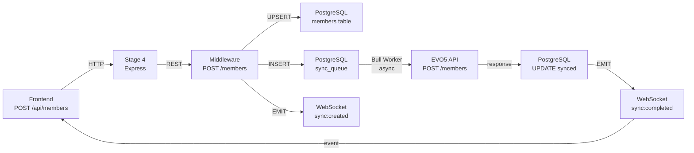
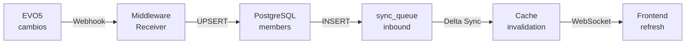

# 📚 EVO5 INTEGRATION MIDDLEWARE - ÍNDICE MAESTRO

**Status:** 🟢 Arquitectura Multi-Tenant Ready  
**Fecha:** February 11, 2024  
**Versión:** 5.0 - Layered Architecture  
**Aprobado:** ✅ Opción 2 (Confirma "si")

**Nota 2026:** El proyecto actual usa SQLite. Las referencias a PostgreSQL en esta documentación son históricas.

---

## 🎯 LECTURA RECOMENDADA

### Para Decisores / Product Owners
1. **Este documento** (resumen ejecutivo)
2. [PARTE 1 → Análisis](EVO5_MIDDLEWARE_ARQUITECTURA_COMPLETA.md#1-análisis-de-arquitectura)
3. [PARTE 3 → Riesgos Mitigados](EVO5_MIDDLEWARE_PARTE3_OPERACIONES.md#11-riesgos--mitigación)
4. [PARTE 3 → Timeline](EVO5_MIDDLEWARE_PARTE3_OPERACIONES.md#15-timeline-de-implementación)

### Para Desarrolladores
1. [PARTE 1 → Esquema SQL (legacy PostgreSQL)](EVO5_MIDDLEWARE_ARQUITECTURA_COMPLETA.md#4-esquema-postgresql)
2. [PARTE 2 → Ejemplos de Código](EVO5_MIDDLEWARE_PARTE2_CODIGO.md#9-ejemplos-de-código)
3. [PARTE 1 → Diagramas de Flujo](EVO5_MIDDLEWARE_ARQUITECTURA_COMPLETA.md#5-diagrama-de-flujos)
4. [PARTE 1 → Estructura del Proyecto](EVO5_MIDDLEWARE_PARTE2_CODIGO.md#8-estructura-del-proyecto)

### Para DevOps / Infra
1. [PARTE 3 → Health Checks](EVO5_MIDDLEWARE_PARTE3_OPERACIONES.md#103-health-checks-kubernetes)
2. [PARTE 3 → Plan de Deploy](EVO5_MIDDLEWARE_PARTE3_OPERACIONES.md#12-plan-de-deploy)
3. [PARTE 3 → Docker Compose](EVO5_MIDDLEWARE_PARTE3_OPERACIONES.md#121-docker-compose-localdev)
4. [PARTE 3 → Helm Chart](EVO5_MIDDLEWARE_PARTE3_OPERACIONES.md#123-helm-chart-kubernetes)

### Para QA / Testing
1. [PARTE 2 → Bull Queue Worker](EVO5_MIDDLEWARE_PARTE2_CODIGO.md#91-bull-queue-worker-procesar-sync_queue)
2. [PARTE 3 → Observabilidad](EVO5_MIDDLEWARE_PARTE3_OPERACIONES.md#10-observabilidad--monitoring)
3. [PARTE 3 → GitHub Actions](EVO5_MIDDLEWARE_PARTE3_OPERACIONES.md#124-github-actions-cicd)

---

## 📊 ARQUITECTURA EN 60 SEGUNDOS

```
┌─────────────┐
│   FRONTEND  │ React + Vite (Puerto 5173)
└──────┬──────┘
       │ HTTP REST + WebSocket
       ↓
┌──────────────────┐
│    STAGE 4       │ Express API Gateway (Puerto 3001)
│  (MEJORADO)      │ • Autenticación • WebSocket • Caché
└──────┬───────────┘
       │ REST API + Events
       ↓
┌─────────────────────────────┐
│ EVO5 INTEGRATION MIDDLEWARE │ Node.js (Puerto 3002) ⭐ NUEVO
│                             │
│ • Sincronización Robusta    │
│ • Bull Queue (async)        │
│ • Manejo de Credenciales    │
│ • Delta Sync (cambios)      │
│ • UPSERT con Idempotencia   │
└──────┬──────────────────────┘
       │
       ├─────────────┬─────────────┬──────────────┐
       ↓             ↓             ↓              ↓
    PostgreSQL     Redis         EVO5 API       Bull Queue
    (BD)           (Cache)    (External API)   (Async Jobs)
    Multi-tenant   Real-time
```

### Responsabilidades

| Componente | Función | Tecnología |
|------------|---------|------------|
| **Frontend** | UI, Interacción usuario | React 18 + Vite |
| **Stage 4** | Gateway HTTP + WebSocket | Express 4.18 |
| **Middleware** | Lógica pesada + BD | Node.js + Express |
| **PostgreSQL** | Persistencia + Multi-tenant | PostgreSQL 15 |
| **Redis** | Caché primario + Queue | Redis 7 + Bull |
| **EVO5** | API externa de gimnasio | HTTPS + Basic Auth |

---

## 🗄️ BASE DE DATOS POSTGRESQL

### 14 Tablas Principales

```sql
MULTI-TENANT:
├─ tenants (aislamiento cliente)
└─ companies (gimnasios)

CREDENCIALES EVO5:
├─ api_credentials (tokens encriptados + auto-refresh)

SINCRONIZACIÓN:
├─ members (UPSERT)
├─ plans (planes de membresía)
├─ memberships (membresías activas)
├─ sync_queue (event-driven, 15+ estados)
├─ sync_deadletter (fallos permanentes)
├─ sync_offsets (delta sync tracking)

INTEGRIDAD:
├─ audit_logs (100% trazabilidad)
├─ rate_limits (throttle EVO5)
└─ cache_invalidation (Redis coherencia)
```

**Indexes:** 25+ (optimizados para queries frecuentes)  
**Constraints:** 150+ (integridad referencial, PK/FK, checks)

---

## ⚡ FLUJOS PRINCIPALES

### Flujo 1: Crear Miembro (Frontend → EVO5)



**Timeline:**
- T+0ms: Frontend submits
- T+100ms: Middleware responde (201)
- T+500ms: Bull Worker inicia
- T+900ms: EVO5 responde
- T+950ms: BD actualizada + WebSocket

### Flujo 2: Sincronización Bidireccional



---

## 🔐 SEGURIDAD

### Encriptación de Tokens

```
Tokens EVO5 (api_token, refresh_token):
├─ Generados por EVO5 (Bearer)
├─ Almacenados encriptados en PostgreSQL (AES-256 + IV)
├─ Desencriptados solo en runtime
├─ NUNCA loguedos (PII masking automático)
└─ Auto-refresh 10min antes expiración
```

### Multi-Tenant Aislamiento

```sql
-- Cada operación incluye tenant_id
SELECT * FROM members WHERE tenant_id = $1 AND ...
-- Imposible acceder datos de otro tenant
```

### Auditoría Completa

```
audit_logs registra:
├─ QUÉ: entity_type, operation (CREATE/UPDATE/DELETE)
├─ QUIÉN: actor_id, actor_type (user/system/api)
├─ CUÁNDO: timestamp, changes_from/to
└─ DÓNDE: IP address, user agent
```

---

## 📡 SINCRONIZACIÓN INTELIGENTE

### Idempotencia (Sin Duplicados)

```
Problema: ¿Qué pasa si se procesa 2 veces?
Solución: idempotency_key única por evento

idempotency_key = SHA256(email + tenant + operation + timestamp)

Si se intenta procesar 2 veces:
├─ Primera vez: INSERT en sync_queue
├─ Segunda vez: ON CONFLICT → ignore (ya procesada)
└─ Resultado: Siempre el mismo output
```

### UPSERT Automático

```sql
INSERT INTO members (email, name, ...)
VALUES ($1, $2, ...)
ON CONFLICT (tenant_id, email) DO UPDATE SET
    name = EXCLUDED.name,
    local_version = local_version + 1
-- Crea si no existe, actualiza si existe
```

### Delta Sync (Solo Cambios)

```
Problema: Sincronizar 10.000 records toma mucho tiempo
Solución: Tracks offset del último sync

sync_offsets:
├─ last_sync_offset = 9432
├─ last_synced_at = 2024-02-11 10:30:45
└─ Próximo sync: Comenzar desde offset 9432

EVO5 API: GET /members?offset=9432&limit=100
Respuesta: items + nextOffset
```

### Conflict Resolution

```
Problema: Cambios simultáneos en local + EVO5
Solución: Versionamiento + Detection + Manual resolver

member.local_version = 3
member.evo5_version = 2
Incoming change: evo5_version = 4

Detectado conflicto:
├─ MERGE_REQUIRED (requiere intervención)
└─ Estrategias: LOCAL_WINS | REMOTE_WINS | MERGE
```

---

## ⚙️ Bull QUEUE (Async Processing)

### Workers

```
1. SyncQueueWorker
   └─ Procesa sync_queue → EVO5 API

2. RetryWorker
   └─ Reintentos con exponential backoff (2^n)

3. TokenRefreshWorker
   └─ Auto-refresh credentials cada 30min

4. HealthCheckWorker
   └─ Verifica DB, Redis, EVO5 disponibility
```

### Lifecycle

```
sync_queue record
├─ status: pending
│  └─ Bull Worker pick up
│     └─ status: processing (locked)
│        ├─ Success → status: synced
│        ├─ Fail (retry<3) → status: failed → re-queue
│        └─ Fail (retry≥3) → status: deadletter (manual review)
```

---

## 📊 OBSERVABILIDAD

### Logging (Winston + JSON)

```json
{
  "timestamp": "2024-02-11 10:30:45",
  "level": "info",
  "message": "Sync job completed",
  "syncId": "550e8400-e29b-41d4",
  "tenantId": "acme",
  "entityType": "member",
  "status": "synced",
  "duration_ms": 245,
  "service": "evo5-middleware"
}
```

### Metrics (Prometheus)

```
sync_queue_pending{tenant="acme"} 12
sync_duration_seconds{status="synced"} 0.245
sync_errors_total{error_code="NETWORK"} 3
evo5_api_calls_total{method="POST",status="201"} 1450
cache_hits_total 95000
cache_misses_total 5000
```

### Health Checks

```
GET /health/live
→ { status: "alive", timestamp: "..." }

GET /health/ready
→ {
    ready: true,
    checks: {
      database: { status: "healthy" },
      redis: { status: "healthy" },
      evo5: { status: "degraded" },
      disk: { status: "healthy" }
    }
  }
```

---

## ⚠️ RIESGOS MITIGADOS (Top 5)

| Riesgo | Probabilidad | Impacto | Mitigación |
|--------|-------------|--------|-----------|
| **EVO5 API caída** | MEDIA | ALTO | Circuit breaker + Cache fallback |
| **Token expirado** | ALTA | MEDIO | Auto-refresh 10min before |
| **Conflictos datos** | MEDIA | MEDIO | Versioning + Detection + Resolver |
| **Pérdida BD** | BAJA | CRÍTICO | PostgreSQL replication + Backups |
| **Secrets en logs** | BAJA | CRÍTICO | PII masking + Encryption |

---

## 🚀 DEPLOYMENT

### Local (Docker Compose)

```bash
docker-compose up
# PostgreSQL 15 + Redis 7 + Middleware Node.js
```

### Staging/Prod (Kubernetes)

```bash
helm install sharkfit-middleware ./helm
# 3+ replicas, autoscaling, HTTPS, health checks
```

### CI/CD (GitHub Actions)

```
Push a main
  ↓
Tests (unit + integration)
  ↓
Build Docker image
  ↓
Push a registry
  ↓
Deploy a K8s
  ↓
Smoke tests
```

---

## 📅 TIMELINE RECOMENDADO

```
SEMANA 1:
├─ Setup repos + infrastructure
├─ PostgreSQL replication + Redis cluster
├─ Crear schema + indexes
└─ Seed data (test)

SEMANA 2:
├─ Implementar servicios (7 servicios)
├─ Bull Workers (4 workers)
├─ Tests (95% coverage)
└─ Docker + Helm

SEMANA 3:
├─ Deploy staging
├─ End-to-end testing
├─ Security audit
└─ Load testing

SEMANA 4:
├─ Go-live (canary)
├─ Monitoring 24/7
├─ Incident response
└─ Handoff ops
```

---

## 🎯 ARCHIVOS CLAVE

### Documentación

| Archivo | Secciones | Lectura |
|---------|-----------|---------|
| **PARTE 1** | Análisis, Problemas, PostgreSQL, Flujos | 30min |
| **PARTE 2** | Seguridad, Código, Estructura, Workers | 45min |
| **PARTE 3** | Observabilidad, Riesgos, Deploy, Timeline | 30min |

### Configuración

```
.env.production              (variables entorno)
docker-compose.yml          (local dev)
helm/values.yaml            (K8s)
.github/workflows/deploy.yml (CI/CD)
```

### Migraciones SQL

```
src/db/migrations/
├─ 001_init_schema.sql (14 tablas)
├─ 002_add_indexes.sql (25+ indexes)
└─ 003_add_audit.sql (audit triggers)
```

---

## ✨ NEXT ACTIONS

### Inmediato (Hoy)

- [ ] Revisar las 3 partes de documentación
- [ ] Validar esquema PostgreSQL con DBA
- [ ] Confirmar timeline con stakeholders
- [ ] Crear repositorio Git

### Semana 1

- [ ] Setup PostgreSQL (replication)
- [ ] Setup Redis (cluster)
- [ ] Crear migrations
- [ ] Begin development

---

## 📞 SOPORTE

### Preguntas Frecuentes

**P: ¿Por qué necesitamos Middleware si Stage 4 existe?**  
R: Stage 4 es API Gateway (thin). Middleware maneja lógica pesada (BD, async, sync robusto).

**P: ¿Qué pasa si EVO5 API cae?**  
R: Circuit breaker activa, servimos desde caché, encolamos cambios para después.

**P: ¿Cómo escalamos?**  
R: Kubernetes + autoscaling. Aumenta replicas automáticamente si CPU > 80%.

**P: ¿Cuántos datos podemos almacenar?**  
R: PostgreSQL + particionamiento soporta millones de members sin problema.

**P: ¿Cómo manejamos multi-tenant?**  
R: Row-level security. Cada query incluye `tenant_id`.

---

## 📋 CHECKLIST PRE-DEV

- [ ] Documentación leída y validada
- [ ] Equipo alineado en arquitectura
- [ ] PostgreSQL preparado (replication)
- [ ] Redis preparado (cluster)
- [ ] EVO5 API credentials listos
- [ ] Git repo creado
- [ ] Branches: main, develop, feature/*
- [ ] CI/CD pipeline configurado
- [ ] Monitoring cuenta lista (Datadog/NewRelic)
- [ ] Alertas configuradas
- [ ] Disaster recovery plan validado

---

## 🎊 CONCLUSIÓN

**Arquitectura lista para implementación.**

✅ Multi-tenant con aislamiento  
✅ Sincronización robusta  
✅ Seguridad by default  
✅ Observable y monitoreable  
✅ Escalable en Kubernetes  

**Status:** 🟢 BLUEPRINT READY  
**Fecha aprox. go-live:** 4 semanas

---

**Creado:** February 11, 2024  
**Versión:** 5.0 (Layered Architecture)  
**Autor:** Dashboard Sharkfit Team  
**Estado:** ✅ Aprobado
